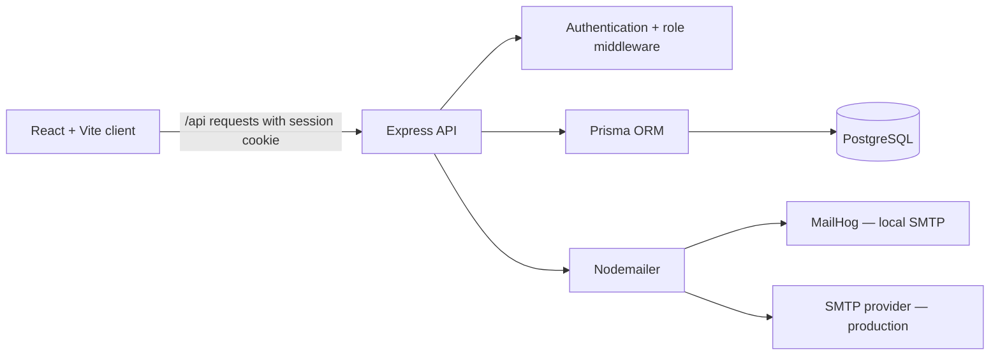

# Storefront Ratings

[](https://github.com/MrPrathameshGadhave/storefront-ratings/actions/workflows/ci.yml)

> A secure, role-based platform for discovering stores and managing one rating per customer — built for the **FullStack Intern Coding Challenge · V1.1**.

**Repository:** [github.com/MrPrathameshGadhave/storefront-ratings](https://github.com/MrPrathameshGadhave/storefront-ratings)

**Live application:** [storefront-ratings.vercel.app](https://storefront-ratings.vercel.app)

Storefront Ratings gives each participant a focused experience: customers discover and rate stores, store owners understand feedback for their own store, and administrators manage the whole platform from one place. The project is deliberately built as a complete full-stack submission, with validation, authorization, testing, local email verification, database migrations, and production-build support included.

## Reviewer snapshot

| Area                      | What is implemented                                                                                                                                                           |
| ------------------------- | ----------------------------------------------------------------------------------------------------------------------------------------------------------------------------- |
| **Three-role product**    | Normal User, System Administrator, and Store Owner experiences with server-enforced access control.                                                                           |
| **Rating workflow**       | Search and sort stores; create or update exactly one 1–5 rating per signed-in normal user and store.                                                                          |
| **Administration**        | Platform totals, user/store creation, store-owner assignment, filtering, sorting, and user-detail views.                                                                      |
| **Email verification**    | Registration is protected by a time-limited OTP with resend cooldown and attempt limits.                                                                                      |
| **Privileged onboarding** | An Administrator can issue email-bound, one-time Administrator or Store Owner invitations using a confidential link plus a separate code.                                     |
| **Quality controls**      | Client/server validation, password hashing, HTTP-only sessions, rate limits, loading states, error states, and responsive layouts.                                            |
| **Evidence**              | Automated tests, an isolated real-PostgreSQL integration suite, linting, type checks, Prisma validation, a production build, and live Vercel route/health checks have passed. |

The application is deployed on Vercel with Neon PostgreSQL, and the production health endpoint reports a connected database. The final acceptance check is receiving a newly requested OTP in a real recipient inbox; the SMTP settings themselves are encrypted in Vercel and never committed.

## Assignment compliance at a glance

| Requirement area        | Delivered behavior                                                                                                                                                                                                                |
| ----------------------- | --------------------------------------------------------------------------------------------------------------------------------------------------------------------------------------------------------------------------------- |
| User accounts and roles | Administrators can create normal users, administrators, stores, and store-owner assignments. Public signup remains normal-user only; privileged invitations add a controlled onboarding path for Administrators and Store Owners. |
| Store discovery         | Normal users can browse, search by store name or address, inspect aggregate ratings, and sort results.                                                                                                                            |
| Store ratings           | A normal user can submit a rating from 1 to 5 and later replace it; the current personal rating and aggregate score are shown.                                                                                                    |
| Administrator tools     | Dashboard totals; searchable, sortable user and store lists; filters; user details; and owner-store context.                                                                                                                      |
| Store-owner tools       | A store owner can view the assigned store’s average rating and only the users who rated that store.                                                                                                                               |
| Validation and security | Required fields, email format, password rules, address/name limits, rating boundaries, authentication, role authorization, and safe query handling.                                                                               |

For the complete requirement-by-requirement mapping, see [REQUIREMENTS.md](REQUIREMENTS.md).

## Experiences by role

| Role                     | Primary journey                                                                                                                                                             |
| ------------------------ | --------------------------------------------------------------------------------------------------------------------------------------------------------------------------- |
| **Normal User**          | Register → verify email OTP → sign in → search or sort stores → submit/update a rating → manage password.                                                                   |
| **System Administrator** | Sign in → review platform totals → create users and stores → issue confidential privileged invitations → assign a store owner → filter/sort records → inspect user details. |
| **Store Owner**          | Sign in → see the assigned store’s rating average → review the customers who rated that store → manage password.                                                            |

The client provides role-aware navigation for a clear user experience. The Express API remains the security boundary: every private request validates the session and the caller’s role on the server.

## Architecture



The production Express server can serve the compiled Vite application and API from the same origin. Locally, Vite proxies `/api` requests to the Express server for a fast development loop.

## Technology choices

- **Frontend:** React 19, TypeScript, Vite, React Router
- **Backend:** Express 5, TypeScript, Zod
- **Data:** PostgreSQL with Prisma
- **Authentication:** JWT in an HTTP-only cookie, bcrypt password hashing
- **Email:** Nodemailer; MailHog for local inspection and a configurable SMTP provider for production
- **Quality:** Vitest, ESLint, Prettier, TypeScript, Prisma validation

## Evaluator quick start

### 1. Prerequisites

- Node.js 20+
- npm
- Docker Desktop (recommended for local PostgreSQL and MailHog), or compatible local services

### 2. Start the local services

Docker Compose starts only the dependencies required for development:

| Service          | Purpose                | Default host port |
| ---------------- | ---------------------- | ----------------- |
| `postgres`       | PostgreSQL 16 database | `5432`            |
| `mailhog`        | SMTP capture service   | `1025`            |
| `mailhog` web UI | View local OTP emails  | `8025`            |

```bash
docker compose up -d
```

If port `5432` is already occupied, start Compose with `POSTGRES_PORT=5434` and update the port in `DATABASE_URL` to match.

### 3. Configure, migrate, seed, and run

In PowerShell:

```powershell
Copy-Item .env.example .env
npm ci
npm run prisma:generate
npm run prisma:migrate
npm run prisma:seed
npm run dev
```

For macOS/Linux, use `cp .env.example .env` for the first command.

Open the following local endpoints:

| URL                                | Purpose                                    |
| ---------------------------------- | ------------------------------------------ |
| `http://localhost:5173`            | Application                                |
| `http://localhost:4000/api/health` | API/database health check                  |
| `http://localhost:8025`            | MailHog inbox for local verification codes |

### 4. Explore the role journeys

After seeding, these **local/demo-only** accounts are available. They are intentionally for local evaluation and must not be used in a real deployment.

| Role          | Email                    | Password     |
| ------------- | ------------------------ | ------------ |
| Administrator | `admin@storefront.local` | `DemoPass!1` |
| Store Owner   | `owner@storefront.local` | `DemoPass!1` |
| Normal User   | `user@storefront.local`  | `DemoPass!1` |

The seeded store owner is linked to the seeded store, and the seeded normal user has a sample rating. To evaluate registration, create a new account and retrieve its OTP from MailHog.

## Project map

```text
client/                 React application, routes, pages, components, API client
server/                 Express application, routes, middleware, validation, email
prisma/                 Data model, migrations, and idempotent seed data
compose.yaml            Local PostgreSQL + MailHog dependencies
Dockerfile              Multi-stage production image
README.md               Submission overview and evaluator guide
PROJECT_DOCUMENTATION.md Architecture, API, data model, and deeper implementation notes
REQUIREMENTS.md         Assignment traceability matrix
```

## API overview

Successful responses use `{ "data": ... }`; errors use `{ "error": { "code", "message", "fields"? } }`.

| Method        | Route                                   | Access                   | Purpose                                                                       |
| ------------- | --------------------------------------- | ------------------------ | ----------------------------------------------------------------------------- |
| `GET`         | `/api/health`                           | Public                   | Checks PostgreSQL connectivity.                                               |
| `POST`        | `/api/auth/register`                    | Public                   | Starts normal-user registration and sends an OTP.                             |
| `GET`         | `/api/auth/invitations/:token`          | Confidential link        | Validates an invitation without exposing a role picker or raw account data.   |
| `POST`        | `/api/auth/invitations/:token/register` | Confidential link + code | Redeems a privileged invitation and creates the server-derived role.          |
| `POST`        | `/api/auth/verify-email`                | Public                   | Verifies the OTP and creates the normal-user account.                         |
| `POST`        | `/api/auth/resend-verification`         | Public                   | Replaces the OTP after the cooldown.                                          |
| `POST`        | `/api/auth/login`                       | Public                   | Sets the session cookie for a verified account.                               |
| `POST`        | `/api/auth/logout`                      | Authenticated            | Clears the session.                                                           |
| `GET`         | `/api/auth/me`                          | Authenticated            | Returns the safe current-user profile.                                        |
| `PATCH`       | `/api/auth/password`                    | Authenticated            | Changes the password after verifying the current password.                    |
| `GET`         | `/api/stores`                           | Normal User              | Lists, searches, and sorts stores with aggregate and personal rating data.    |
| `PUT`         | `/api/stores/:storeId/rating`           | Normal User              | Creates or updates the caller’s rating.                                       |
| `GET`         | `/api/admin/dashboard`                  | Administrator            | Returns user, store, and rating totals.                                       |
| `POST`        | `/api/admin/invitations`                | Administrator            | Issues a one-time Administrator or Store Owner invitation for a chosen email. |
| `GET`, `POST` | `/api/admin/users`                      | Administrator            | Lists/filter/sorts users or creates a managed account.                        |
| `GET`         | `/api/admin/users/:userId`              | Administrator            | Returns user details and owner-store summary when applicable.                 |
| `GET`, `POST` | `/api/admin/stores`                     | Administrator            | Lists/searches/sorts stores or creates and optionally assigns one.            |
| `GET`         | `/api/owner/dashboard`                  | Store Owner              | Returns only the caller’s assigned store and its raters.                      |

Detailed request and response contracts are documented in [PROJECT_DOCUMENTATION.md](PROJECT_DOCUMENTATION.md).

## Security and robustness

- Passwords are hashed with bcrypt; they are never returned by the API.
- Sessions use signed JWTs in HTTP-only cookies, reducing exposure to client-side script access.
- OTPs are HMAC-hashed before storage, expire, enforce attempt limits, and use a resend cooldown.
- The public registration form always creates `NORMAL_USER`; the server derives an elevated role only from a valid Administrator-issued invitation.
- Invitation URL tokens and eight-character codes are HMAC-hashed at rest, expire after 72 hours, are single-use, and stop after repeated incorrect code attempts.
- A one-time, environment-backed first-Administrator bootstrap is available only while no Administrator exists; remove its secrets immediately after use.
- Authentication endpoints are rate-limited.
- Zod validates request inputs on the server; the client mirrors important rules for immediate feedback.
- Role checks are enforced per protected endpoint, not only by the UI.
- Database access uses Prisma rather than assembled SQL strings.
- Production configuration requires a strong JWT secret and secure cookies.

## Environment configuration

Copy [.env.example](.env.example) and replace all development placeholders before production use.

| Variable                                                                      | Purpose                                                                                                                                                |
| ----------------------------------------------------------------------------- | ------------------------------------------------------------------------------------------------------------------------------------------------------ |
| `DATABASE_URL`                                                                | PostgreSQL connection string.                                                                                                                          |
| `NODE_ENV`                                                                    | Runtime mode; production enables secure session cookies.                                                                                               |
| `PORT`                                                                        | API port; defaults to `4000`.                                                                                                                          |
| `CLIENT_ORIGIN`                                                               | Allowed browser origin for credentialed CORS.                                                                                                          |
| `TRUST_PROXY`                                                                 | Set `true` only when a trusted reverse proxy correctly supplies client IP headers.                                                                     |
| `JWT_SECRET`                                                                  | Long, unique server secret; production requires at least 32 characters and rejects the example value.                                                  |
| `JWT_EXPIRES_IN`                                                              | JWT lifespan; defaults to `8h`.                                                                                                                        |
| `SMTP_HOST`, `SMTP_PORT`                                                      | SMTP host and port; local defaults target MailHog.                                                                                                     |
| `SMTP_USER`, `SMTP_PASSWORD`                                                  | Provider credentials. `SMTP_PASS` is supported for Gmail compatibility; prefer `SMTP_PASSWORD` for new setups.                                         |
| `SMTP_FROM`                                                                   | Sender shown on the verification email.                                                                                                                |
| `ADMIN_BOOTSTRAP_TOKEN`, `ADMIN_BOOTSTRAP_CODE`, `ADMIN_BOOTSTRAP_EXPIRES_AT` | Three server-only values for a deliberately time-bounded first-Administrator bootstrap. Set all three together only for an otherwise empty deployment. |

Never commit a populated `.env`, production connection string, JWT secret, or SMTP credentials.

## Quality evidence

The following checks have passed in the current workspace:

```bash
npm test                # 77 passed; 2 isolated real-database tests skipped by default
npm run lint
npm run typecheck
npx prisma validate
npm run build
```

The real-PostgreSQL integration suite has also passed when deliberately enabled with an isolated test database. It covers registration, OTP verification, sign-in, rating creation/update, and administrator/store-owner authorization boundaries.

The default automated suite covers validation limits, rating bounds, OTP hashing and lifecycle behavior, cooldowns, authorization, unauthenticated access, rating upsert behavior, and safe query handling. In addition, the local migration/seed flow, MailHog OTP delivery, and a browser registration/verification journey have passed.

## Commands

| Command                   | Purpose                                                           |
| ------------------------- | ----------------------------------------------------------------- |
| `npm run dev`             | Run the API and Vite client together.                             |
| `npm run dev:api`         | Run the Express API in watch mode.                                |
| `npm run dev:web`         | Run Vite only.                                                    |
| `npm run prisma:generate` | Generate Prisma client code.                                      |
| `npm run prisma:migrate`  | Create/apply a development migration.                             |
| `npm run prisma:deploy`   | Apply committed migrations in a deployment environment.           |
| `npm run prisma:seed`     | Create/update the safe local demo records.                        |
| `npm test`                | Run the Vitest suite.                                             |
| `npm run lint`            | Run ESLint with zero warnings allowed.                            |
| `npm run typecheck`       | Type-check the Vercel API wrapper, server, and client.            |
| `npm run build`           | Generate Prisma client and build API/client production artifacts. |
| `npm start`               | Start the compiled production API/server.                         |

## Production status

The public deployment is live at [storefront-ratings.vercel.app](https://storefront-ratings.vercel.app). Vercel serves the Vite SPA and the Express API from the same origin, while Neon supplies managed PostgreSQL. The repository includes a multi-stage [Dockerfile](Dockerfile) for a conventional Node deployment; Docker Compose remains intentionally scoped to local PostgreSQL and MailHog.

Before submission, complete this final smoke-test checklist:

1. Register a normal-user account and confirm the OTP arrives in its recipient inbox.
2. If this is a fresh database, use the one-time Administrator bootstrap link and code, sign in, then delete the bootstrap environment variables and redeploy.
3. From the Administrator invitation screen, create and redeem one Administrator and one Store Owner invitation; confirm the shared login sends each role to its own dashboard.
4. Verify the OTP, sign in as a normal user, and submit or update a store rating.
5. Refresh a direct route such as `/register` or `/login` to confirm SPA routing remains intact.

## Further reading

- [Project documentation](PROJECT_DOCUMENTATION.md) — architecture, data model, API contract, security design, setup, and deployment details.
- [Requirements traceability](REQUIREMENTS.md) — assignment requirement mapping.
- [Registration troubleshooting](REGISTRATION_ERROR_FIX.md) — local OTP setup and failure diagnosis.
- [Task plan](TASKS.md) — scope and delivery record.

## Author

Prathamesh Kisan Gadhave
